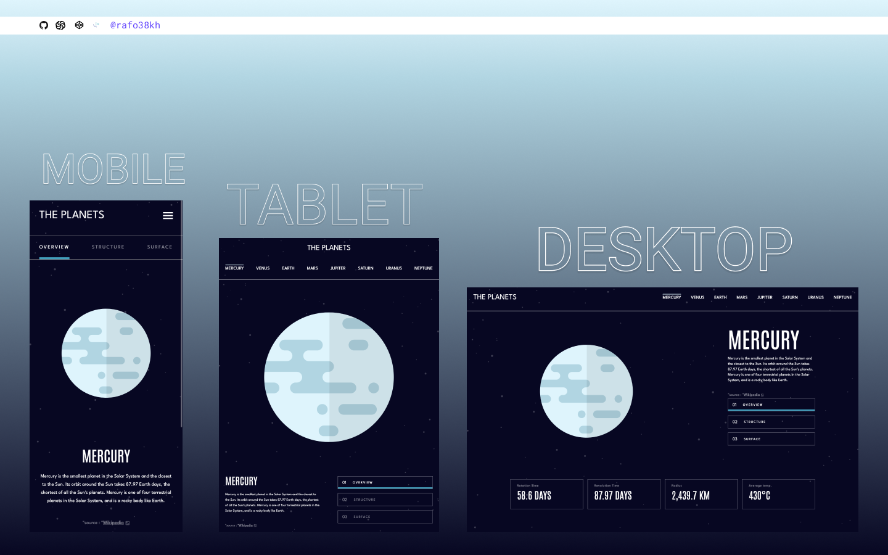

# Frontend Mentor - Planets Fact Site Solution

This is a solution to the [Planets Fact Site Challenge on Frontend Mentor](https://www.frontendmentor.io/challenges/planets-fact-site-gazqN8w_f)

## Table of contents

- [Overview](#overview)
  - [The challenge](#the-challenge)
  - [Screenshot](#screenshot)
  - [Links](#links)
- [My process](#my-process)
  - [Built with](#built-with)
- [Author](#author)

## Overview

### The challenge

### Screenshot

### Links

- Solution URL: [https://www.frontendmentor.io/challenges/planets-fact-site-gazqN8w_f](https://www.frontendmentor.io/challenges/planets-fact-site-gazqN8w_f)
- Live Site URL: [http://localhost:3000/planet/mercury](http://localhost:3000/planet/mercury)

## My process

### Built with

- React
- Tailwind CSS
- CSS Flexbox
- Mobile-first workflow

## Author

- Frontend Mentor - [@rafo38kh](https://www.frontendmentor.io/profile/rafo38kh)
- GitHub - [@rafo38kh](https://github.com/rafo38kh)
- Codewars - [@rafo38kh](https://www.codewars.com/users/rafo38kh)
